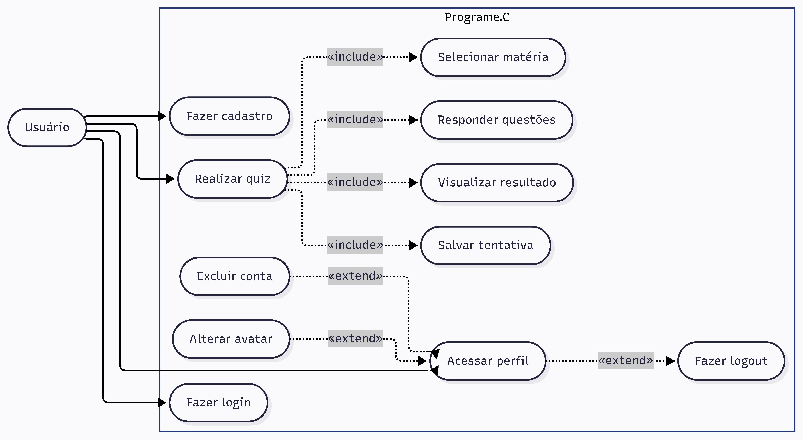

# Programe.C — Aplicativo Flutter

Frontend mobile do Programe.C, um aplicativo educacional de quiz para
estudantes de Tecnologia da Informação.

## Funcionalidades

- Login e cadastro.
- Seleção ou sorteio de matéria.
- Exercícios de múltipla escolha, verdadeiro ou falso e completar código.
- Resultado e salvamento da tentativa.
- Escolha de avatar, logout e exclusão da conta.

## Diagrama de casos de uso



[Abrir o diagrama em PDF](../docs/diagramas/diagrama-casos-de-uso.pdf)

## Estrutura

```text
lib/
|-- common/
|-- models/
|-- screens/
|-- services/
|   `-- api_service.dart
`-- main.dart
```

`ApiService` concentra todas as chamadas HTTP. As telas não acessam o banco
diretamente.

## API REST

URL definida em `lib/services/api_service.dart`:

```dart
const String _baseUrl =
    'http://200.19.1.19/20222GR.ADS0005/programec-api/public';
```

| Método | Recurso | Uso |
| --- | --- | --- |
| POST | `/usuarios` | Criar conta. |
| POST | `/sessoes` | Fazer login. |
| GET | `/usuarios/{id}` | Carregar perfil. |
| PATCH | `/usuarios/{id}` | Alterar o avatar. |
| DELETE | `/usuarios/{id}` | Excluir conta. |
| GET | `/materias` | Listar matérias. |
| GET | `/materias/{id}/exercicios` | Listar exercícios. |
| POST | `/tentativas` | Salvar resultado. |

Os corpos são serializados como JSON em UTF-8. O serviço lê o campo `NumMens`
e apresenta a mensagem devolvida pela API quando uma operação falha.

O logout continua local porque o projeto não utiliza token nem sessão mantida
no servidor.

## Executar

```powershell
cd C:\Users\macob\PDM-Entrega-Francisco\app_flutter
flutter pub get
flutter analyze
flutter run
```

O aplicativo só funcionará com as novas URLs depois que os arquivos PHP da
versão REST forem enviados ao servidor pelo WinSCP.
