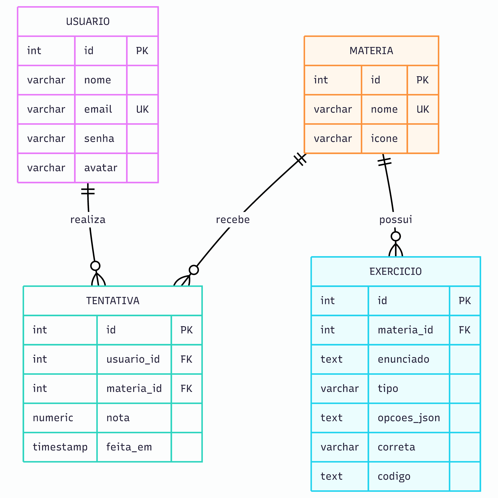

# Programe.C — Banco de Dados

Scripts PostgreSQL usados para criar e popular as tabelas do Programe.C.

O ambiente atual usa o banco interno do IFsul. O projeto não depende mais do Supabase.

## Diagrama entidade-relacionamento

O diagrama mostra as quatro tabelas do projeto, seus campos e relacionamentos.



[Abrir o diagrama entidade-relacionamento em PDF](../docs/diagramas/diagrama-entidade-relacionamento.pdf)

## Arquivos

| Arquivo | Função |
| --- | --- |
| `banco.sql` | Apaga, recria e popula todo o banco de desenvolvimento. |
| `01_schema.sql` | Cria as tabelas e restrições. |
| `02_seed_materias.sql` | Insere ou atualiza as matérias. |
| `03_seed_exercicios.sql` | Recria os exercícios iniciais. |
| `04_seed_usuarios.sql` | Insere ou atualiza o usuário inicial definido no script. |

## Execução

Para recriar tudo:

```sql
-- Execute o conteúdo de banco.sql em um cliente PostgreSQL autorizado.
```

> `banco.sql` remove as tabelas existentes com `DROP TABLE`. Não execute no ambiente remoto sem confirmar que a perda dos dados atuais é aceitável.

Para aplicar por etapas:

1. `01_schema.sql`
2. `02_seed_materias.sql`
3. `03_seed_exercicios.sql`
4. `04_seed_usuarios.sql`

## Tabelas

### `usuario`

Armazena nome, e-mail, senha em hash bcrypt e avatar.

### `materia`

Armazena as matérias exibidas na Home e seus ícones.

### `exercicio`

Armazena os três tipos de questão do quiz.

### `tentativa`

Armazena usuário, matéria, nota e data de cada quiz concluído.

## Tipos de exercício

| Tipo | `opcoes_json` | `correta` | `codigo` |
| --- | --- | --- | --- |
| `multipla_escolha` | Array JSON em texto | Índice da opção correta | `NULL` |
| `verdadeiro_falso` | `NULL` | `0` para verdadeiro ou `1` para falso | `NULL` |
| `completar_codigo` | `NULL` | Texto esperado | Código contendo `_____` |

Exemplo:

```sql
INSERT INTO exercicio (
    materia_id,
    enunciado,
    tipo,
    opcoes_json,
    correta,
    codigo
) VALUES (
    1,
    'O que é SQL?',
    'multipla_escolha',
    '["Linguagem de consulta estruturada","Sistema operacional"]',
    '0',
    NULL
);
```

## Alterações pontuais

Para alterar apenas um valor no banco, prefira um `UPDATE` em vez de executar novamente os seeds completos.

Exemplo de atualização do ícone:

```sql
UPDATE materia
SET icone = '🔌'
WHERE nome = 'Redes';
```

## Usuário de teste

O ambiente publicado utiliza:

```text
email: joao@email.com
senha: 123456
```

Os scripts SQL versionados ainda podem conter outro usuário inicial. Antes de executá-los no banco do IFsul, revise os dados de `04_seed_usuarios.sql` e `banco.sql`.

## Relação com o WinSCP

Alterações SQL são executadas no PostgreSQL por uma ferramenta autorizada e não exigem upload de endpoint.

O WinSCP é necessário quando arquivos PHP do backend precisam ser enviados ao servidor do IFsul.
