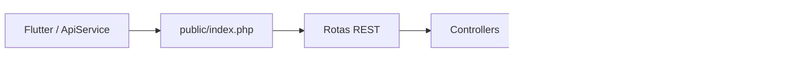

# Programe.C — API REST

API em PHP puro utilizada pelo aplicativo Programe.C. O backend segue uma
arquitetura modular e acessa o PostgreSQL do IFsul por meio de PDO.

## Fluxo

```text
Requisição HTTP
  -> public/index.php
  -> rota REST
  -> Controller
  -> Repository
  -> PostgreSQL do IFsul
  -> resposta JSON
```



## Estrutura

```text
programec-api/
|-- app/
|   |-- Controllers/
|   `-- Repositories/
|-- config/
|-- core/
|   |-- bootstrap.php
|   |-- Request.php
|   `-- Response.php
|-- public/
|   |-- .htaccess
|   `-- index.php
|-- routes/
|-- teste/
`-- README.md
```

- `public/index.php`: ponto de entrada e reconhecimento das rotas.
- `routes`: associa método, caminho, Controller e ação.
- `Controllers`: validam entradas e coordenam as operações.
- `Repositories`: executam SQL no PostgreSQL.
- `Request.php`: interpreta o corpo JSON.
- `Response.php`: produz o formato JSON padronizado.

## URL base

Remota:

```text
http://200.19.1.19/20222GR.ADS0005/programec-api/public
```

Local:

```text
http://localhost/programec-api/public
```

## Recursos REST

| Método | Rota | Resultado |
| --- | --- | --- |
| POST | `/usuarios` | Cria uma conta. |
| GET | `/usuarios/{id}` | Consulta um usuário. |
| PATCH | `/usuarios/{id}` | Altera o avatar. |
| DELETE | `/usuarios/{id}` | Exclui usuário e tentativas. |
| POST | `/sessoes` | Autentica e cria uma sessão lógica. |
| GET | `/materias` | Lista matérias. |
| GET | `/materias/{id}/exercicios` | Lista exercícios da matéria. |
| POST | `/tentativas` | Registra o resultado de um quiz. |

Corpos de `POST` e `PATCH` são enviados como `application/json`.

Exemplo:

```http
PATCH /usuarios/5
Content-Type: application/json

{
  "avatar": "🐧"
}
```

## Códigos HTTP

| Código | Uso |
| --- | --- |
| `200` | Consulta, autenticação, alteração ou exclusão concluída. |
| `201` | Usuário ou tentativa criado. |
| `204` | Resposta à requisição CORS `OPTIONS`. |
| `401` | Credenciais incorretas. |
| `404` | Rota não encontrada. |
| `500` | Erro ao executar uma operação no servidor. |

## Resposta JSON

O formato anterior foi mantido para compatibilidade com os models e telas:

```json
{
  "NumMens": 1,
  "Mensagem": "Descrição do resultado",
  "registros": 1,
  "dados": {}
}
```

Para manter o projeto simples, o aplicativo envia dados já validados pelas
telas. O backend conserva apenas as regras essenciais e usa `NumMens` para
informar sucesso ou falha.

## Executar localmente

Copie `programec-api/` para:

```text
C:\xampp\htdocs\programec-api
```

Inicie o Apache e acesse:

```text
http://localhost/programec-api/public/materias
```

O arquivo `public/.htaccess` precisa estar ativo e o Apache precisa permitir
`mod_rewrite`.

## Publicação pelo WinSCP

O servidor remoto não é atualizado pelo Git. Para esta versão REST, envie:

```text
app/Controllers/ExercicioController.php
app/Controllers/MateriaController.php
app/Controllers/TentativaController.php
app/Controllers/UsuarioController.php
core/Request.php
core/bootstrap.php
config/Database.php
config/Banco.php
public/.htaccess
public/index.php
routes/exercicio_routes.php
routes/tentativa_routes.php
routes/usuario_routes.php
app/Repositories/UsuarioRepository.php
app/Repositories/MateriaRepository.php
app/Repositories/ExercicioRepository.php
app/Repositories/TentativaRepository.php
```

Os repositories e o banco não mudaram. Após o upload, teste primeiro
`GET /public/materias` e somente depois execute o Flutter.
