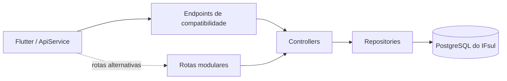

# Programe.C — API

API REST em PHP puro utilizada pelo aplicativo Programe.C. O backend segue a arquitetura modular solicitada na disciplina e se conecta ao PostgreSQL do IFsul por meio de PDO.

## Arquitetura

```text
Requisição HTTP
  -> endpoint de compatibilidade ou public/index.php
  -> rota
  -> Controller
  -> Repository
  -> PostgreSQL do IFsul
  -> Response JSON
```



## Estrutura

```text
programec-api/
|-- app/
|   |-- Controllers/
|   |   |-- ExercicioController.php
|   |   |-- MateriaController.php
|   |   |-- TentativaController.php
|   |   `-- UsuarioController.php
|   `-- Repositories/
|       |-- ExercicioRepository.php
|       |-- MateriaRepository.php
|       |-- TentativaRepository.php
|       `-- UsuarioRepository.php
|-- config/
|   |-- Banco.php
|   `-- Database.php
|-- core/
|   |-- bootstrap.php
|   `-- Response.php
|-- endpoints/
|-- public/
|   |-- .htaccess
|   `-- index.php
|-- routes/
|   |-- exercicio_routes.php
|   |-- materia_routes.php
|   |-- tentativa_routes.php
|   `-- usuario_routes.php
|-- teste/
|   |-- Bruno/
|   `-- teste_conexao/
`-- README.md
```

## Responsabilidades

- `Controllers`: validam entradas e coordenam cada operação.
- `Repositories`: executam consultas e alterações no PostgreSQL.
- `config`: abre e fornece a conexão PDO.
- `core`: centraliza dependências, headers e respostas JSON.
- `routes`: associa método e caminho ao Controller correto.
- `public/index.php`: entrada das rotas modulares.
- `endpoints`: entradas de compatibilidade usadas atualmente pelo Flutter.
- `teste`: coleções e scripts de teste local e remoto.

## Endpoints usados pelo Flutter

O aplicativo atual consome:

```text
http://200.19.1.19/20222GR.ADS0005/programec-api/endpoints
```

| Método | Endpoint | Função |
| --- | --- | --- |
| POST | `/endpoints/cadastro.php` | Cadastra usuário com senha criptografada. |
| POST | `/endpoints/login.php` | Autentica usuário. |
| GET | `/endpoints/perfil.php?id=X` | Busca perfil. |
| POST | `/endpoints/atualizar_usuario.php` | Atualiza nome ou avatar. |
| POST | `/endpoints/deletar_usuario.php` | Exclui usuário e suas tentativas. |
| GET | `/endpoints/materias.php` | Lista matérias. |
| GET | `/endpoints/exercicios.php?materia_id=X` | Lista exercícios de uma matéria. |
| POST | `/endpoints/tentativa.php` | Salva a nota de uma tentativa. |

Esses arquivos não possuem a regra de negócio completa. Eles carregam e executam os Controllers da estrutura modular.

## Rotas modulares

| Método | Rota | Função |
| --- | --- | --- |
| POST | `/public/index.php/cadastro` | Cadastra usuário. |
| POST | `/public/index.php/login` | Autentica usuário. |
| GET | `/public/index.php/perfil?id=X` | Busca perfil. |
| POST | `/public/index.php/atualizar-usuario` | Atualiza perfil. |
| POST | `/public/index.php/deletar-usuario` | Exclui usuário. |
| GET | `/public/index.php/materias` | Lista matérias. |
| GET | `/public/index.php/exercicios?materia_id=X` | Lista exercícios. |
| POST | `/public/index.php/tentativa` | Salva tentativa. |

## Resposta padrão

```json
{
  "NumMens": 1,
  "Mensagem": "Descrição do resultado",
  "registros": 1,
  "dados": {}
}
```

- `NumMens = 1`: operação concluída.
- `NumMens = 0`: erro ou validação recusada.
- `registros`: quantidade de registros retornados.
- `dados`: objeto, lista ou `null`.

## Banco do IFsul

Configuração acadêmica atual:

```text
host: 192.168.20.18
porta: 5432
banco: franciscozanela
usuario: franciscozanela
```

As credenciais são definidas em `config/Banco.php`.

Tabelas utilizadas:

```text
usuario
materia
exercicio
tentativa
```

Usuário utilizado nos testes:

```text
email: joao@email.com
senha: 123456
```

## Executar localmente

Copie a pasta para:

```text
C:\xampp\htdocs\programec-api
```

Inicie o Apache e teste:

```text
http://localhost/programec-api/endpoints/materias.php
http://localhost/programec-api/public/index.php/materias
```

O teste local ainda depende da conectividade com o PostgreSQL interno do IFsul.

## Testes

- `teste/Bruno/local/`: requisições para o ambiente local.
- `teste/Bruno/remoto/`: requisições para o servidor publicado.
- `teste/teste_conexao/teste-IF.php`: testa a API publicada no IFsul.
- `teste/teste_conexao/teste-fora-do-campus.php`: testa a API local.

## Publicação com WinSCP

O servidor remoto não é atualizado automaticamente pelo Git.

Quando um arquivo PHP for alterado ou criado:

1. anote todos os arquivos modificados;
2. conecte-se ao servidor do IFsul pelo WinSCP;
3. envie cada arquivo para o mesmo caminho relativo dentro de `programec-api/`;
4. preserve a estrutura de `app`, `config`, `core`, `endpoints`, `public` e `routes`;
5. teste primeiro o endpoint remoto diretamente;
6. depois teste o fluxo no Flutter.

Se apenas o frontend Flutter for modificado, nenhum upload da API é necessário.

## Segurança

As credenciais permanecem no código por se tratar do ambiente acadêmico atual. Em produção, devem ser substituídas por variáveis de ambiente e segredos fora do repositório.
